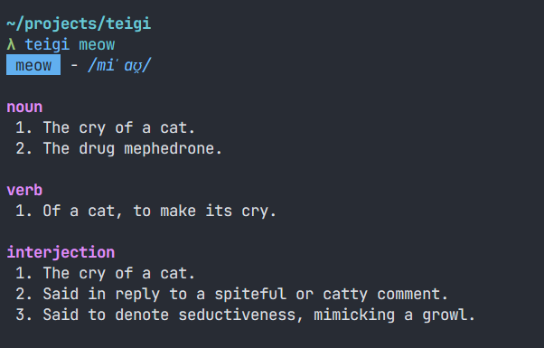

# teigi
> teigi (jp. 定義) - definition

dictionary navigator for the command line, written on zig

~610kb binary (linux x86-64, releaseSmall), no runtime dependencies

[](https://github.com/unitoshka/teigi/releases)




## Installation

### Binaries

Download a binary from the [releases](https://github.com/unitoshka/teigi/releases) page.

### Build from source

Requires Zig 0.16.0+

```sh
git clone https://github.com/unitoshka/teigi
cd teigi
zig build -Doptimize=ReleaseSafe
```

binary will be at `zig-out/bin/teigi`

## Usage
```sh
teigi <word> [options]
```

**Options**
```
-h, --help      Print this help
```

```sh
$ teigi search

search  - /sɜːt͡ʃ/

noun
 1. An attempt to find something.
 2. The act of searching in general.

verb
 1. To look in (a place) for something.
 2. (followed by "for") To look thoroughly.
 3. To look for, seek.
 4. To probe or examine (a wound).
 5. To examine; to try; to put to the test.
```